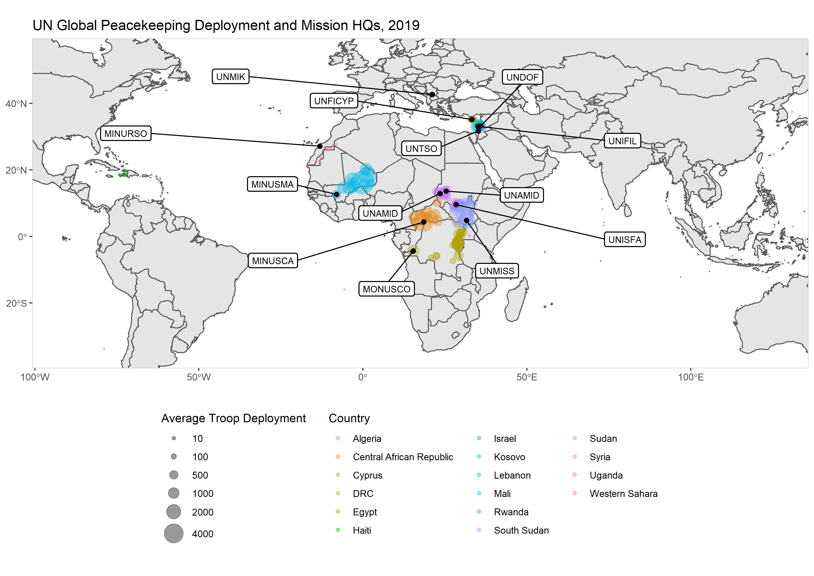
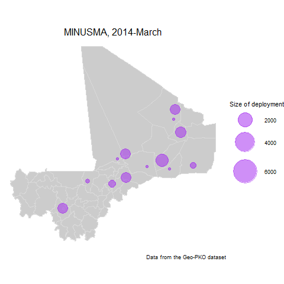

```{r setup, include=FALSE}

library(knitr)
knitr::opts_chunk$set(out.width="650px", dpi=120)

```

The Geo-PKO team has used the dataset to produce a range of visualisations. Here are some ways we have presented data on global peacekeeping deployments and related information. Data is from the Geo-PKO v2.0 dataset, with supplementary data from the Uppsala Conflict Data Programme (UCDP) and Uppsala University's Violence Early Warning System (ViEWS).


```{r echo=FALSE}

```

----------------------------------------------------------------------------------------------------------------------------

```{r echo=FALSE}
include_graphics("gallery/casia.png")
```

----------------------------------------------------------------------------------------------------------------------------

```{r echo=FALSE}
include_graphics("gallery/africa3-2.png")
```

----------------------------------------------------------------------------------------------------------------------------

```{r echo=FALSE, out.width=350}

```

----------------------------------------------------------------------------------------------------------------------------

```{r echo=FALSE}
include_graphics("gallery/mepko.png")
```   

----------------------------------------------------------------------------------------------------------------------------

```{r echo=FALSE}
include_graphics("gallery/troopsconflictrisk.png")
```

----------------------------------------------------------------------------------------------------------------------------

```{r echo=FALSE}
include_graphics("gallery/UNPOLconflictrisk.png")
```

----------------------------------------------------------------------------------------------------------------------------  
```{r echo=FALSE}
include_graphics("gallery/Animated_GeoPKO2.0.gif")
```
